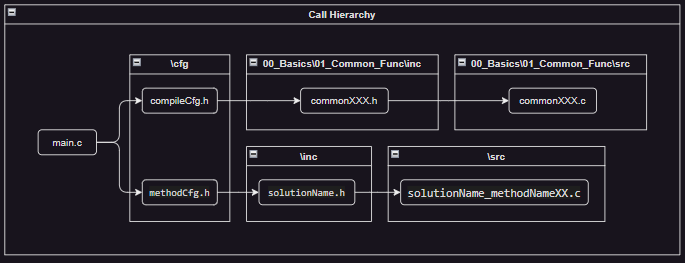

# Practice_LeetCode_C

[](https://opensource.org/licenses/MIT)
[](https://github.com/ImChong/Practice_LeetCode_C/actions/workflows/commonFuncLint.yml)
[](https://github.com/ImChong/Practice_LeetCode_C/actions/workflows/commonFuncTest.yml)
[](https://github.com/ImChong/Practice_LeetCode_C/actions/workflows/github-code-scanning/codeql)

## Workspace Structure

C language leetcode practice overall folder structure:

- [Prerequisite](./00_Basics/) - This folder contains the basic configuration files and common function modules before getting started with the local leetcode practice.
  - [VSCode_Settings](./00_Basics/00_VSCode_Settings) - VSCode settings
  - [Clean_Exe](./00_Basics/02_Clean_Exe/) - Executables to clean all .exe files
- [Common_Func](./00_Basics/01_Common_Func/) - This folder contains the common c function modules based on different programming topics.
- [Programming_Topics](./01_Programming_Topics/) - ([Programming Carl Series](https://programmercarl.com/) / [Labuladong's Algorithm Cheat Sheet](https://labuladong.github.io/algo/home/)) - This folder contains the leetcode practice questions by programming topics.
  - [Array](./01_Programming_Topics/01_Array/)
  - [Linked_List](./01_Programming_Topics/02_Linked_List/)
  - [Hash_Table](./01_Programming_Topics/03_Hash_Table/)
  - [String](./01_Programming_Topics/04_String/)
  - [Double_Pointer](./01_Programming_Topics/05_Double_Pointer/)
  - [Stack_Queue](./01_Programming_Topics/06_Stack_Queue/)
  - [Binary_Tree](./01_Programming_Topics/07_Binary_Tree/)
  - [Backtracking](./01_Programming_Topics/08_Backtracking/)
  - [Greedy](./01_Programming_Topics/09_Greedy/)
  - [Dynamic_Programming](./01_Programming_Topics/10_Dynamic_Programming/)
  - [Monotone_Stack](./01_Programming_Topics/11_Monotone_Stack/)
  - [Graph_Theory](./01_Programming_Topics/12_Graph_Theory/)
  - [Binary_Search](./01_Programming_Topics/13_Binary_Search/)
  - [Breath_First_Search](./01_Programming_Topics/14_Breath_First_Search/)
  - [Depth_First_Search](./01_Programming_Topics/15_Depth_First_Search/)
  - [Sliding_Window](./01_Programming_Topics/16_Sliding_Window/)
  - [Buy_And_Sell](./01_Programming_Topics/17_Buy_And_Sell/)
  - [House_Robber](./01_Programming_Topics/18_House_Robber/)
  - [N_Sum](./01_Programming_Topics/19_N_Sum/)
- [Misc](./02_Misc/) - This folder contains miscellaneous topics.
  - [Programming_Notes](./02_Misc/00_Programming_Notes/)
  - [Real_World_Problem](./02_Misc/01_Real_World_Problems/)
  - [Supplementary_Materials](./02_Misc/02_Supplementary_Materials/)

## Common Function Modules

To ensure code quality, all shared common code based on different programming topics will be placed in the [Common_Func](00_Basics/01_Common_Func/) folder following these workflows:

| Workflows | Source Code |
|----------|----------|
|   [](https://github.com/ImChong/Practice_LeetCode_C/actions/workflows/commonFuncLint.yml)  |   [commonFuncLint.yml](.github/workflows/commonFuncLint.yml)   |
|   [](https://github.com/ImChong/Practice_LeetCode_C/actions/workflows/commonFuncTest.yml)  |   [commonFuncTest.yml](.github/workflows/commonFuncTest.yml)   |

## Code Structure

> The code structure of each question is as follows:
>
> ```txt
> .
> ├── cfg                               /* configuration folder */
> │   ├── compileCfg.h                      /* common function configuration file */
> │   └── methodCfg.h                       /* solution method configuration file */
> ├── doc                               /* documentation folder */
> │   ├── sketch.drawio                     /* drawing sketch file */
> │   └── sketch.excalidraw                 /* drawing sketch file */
> ├── inc                               /* header folder */
> │   └── solutionName.h                    /* solution header file */
> ├── src                               /* source folder */
> │   ├── solutionName_methodName01.c       /* solution method 01 source file */
> │   ├── solutionName_methodName02.c       /* solution method 02 source file */
> │   ├── ...
> │   └── solutionName_methodNameXX.c       /* solution method XX source file */
> └── main.c                            /* main.c file */
> ```
>
> **Example**: `\Practice_LeetCode_C\01_Programming_Topics\01_Array\01_binarySearch\main.c`
>
> The call hierarchy between files is as follow:
>
> 

## Build & Run Code

### Operating Systems

> - Windows
> - Ubuntu

### Build Tool Versions

> - Python 3.12.1
> - gcc.exe (Rev7, Built by MSYS2 project) 13.1.0
> - g++.exe (Rev7, Built by MSYS2 project) 13.1.0
> - GNU gdb (GDB) 13.2

### VSCode Native - Build & Run Current File

> To execute the source code in VSCode, choose the desired `main.c` file and navigate to the following tab and options in the VSCode interface:
>
> ```txt
> Terminal -> Run Task... -> Build & Run Current File
> ```
>
> or simply press
>
> ```txt
> Ctrl + Shift + B
> ```
>
> Source code: [tasks.json](.vscode/tasks.json) and [python build.py](.vscode/build.py).

### VSCode Extension - Code Runner

> The `Code Runner` vscode extension provides a convenient way to execute the `main.c` file directly.
>
> Source code: [settings.json](.vscode/settings.json).

### Build Process

> TODO

## Debug Code

> To facilitate source code debugging in VSCode, select the `main.c` file that you wish to run.
> First, build and run the source code as described in the previous section.
> Then, click the following button in VSCode:
>
> ```txt
> Run and Debug (Ctil+Shift+D) -> (gdb) Debug Main
> ```
>
> or simply press
>
> ```txt
> F5
> ```
>
> Source code: [launch.json](.vscode/launch.json).

## Clean all .exe files

> To ensure a clean development environment, it is important to remove unnecessary executable files.
> The following steps can be used to clean all .exe files:
>
> First, open the terminal by pressing
>
> ```txt
> ctrl + ~
> ```
>
> then run
>
> ```txt
> .\00_Basics\02_Clean_Exe\killexe.bat        /* windows system */
> ./00_Basics/02_Clean_Exe/killexe.sh         /* linux system */
> ```
>
> Source code: [killExes.bat](./00_Basics/02_Clean_Exe/killExes.bat) and [killExes.sh](./00_Basics/02_Clean_Exe/killExes.sh).
