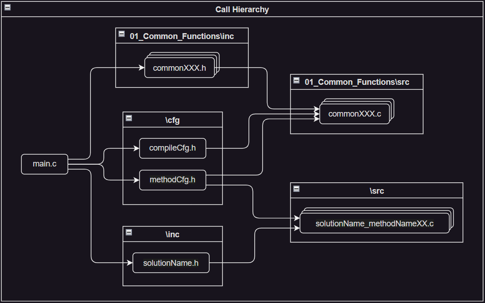

# Practice_LeetCode_C

| Topics | Badges |
|:-:|:-|
| License | [](https://opensource.org/licenses/MIT) |
| Workflows | [](https://github.com/ImChong/Practice_LeetCode_C/actions/workflows/commonFuncLint.yml) [](https://github.com/ImChong/Practice_LeetCode_C/actions/workflows/commonFuncTest.yml) |
| CodeQL | [](https://github.com/ImChong/Practice_LeetCode_C/actions/workflows/github-code-scanning/codeql) |

## Workspace Structure

C language leetcode practice overall folder structure:

- [Prerequisite](./00_Prerequisite/) - This folder contains the basic configuration files and common function modules before getting started with the local leetcode practice.
  - [VSCode_Settings](./00_Prerequisite/00_VSCode_Settings/) - VSCode settings
  - [Clean_Exe](./00_Prerequisite/01_Clean_Exe/) - Scripts to clean all .exe files
- [Common_Functions](./01_Common_Functions/) - Common C functions used by different programming topics with quality check workflows deployed.
  - [cfg](./01_Common_Functions/cfg/) - Common function configuration file template.
  - [inc](./01_Common_Functions/inc/) - Common function header files.
  - [src](./01_Common_Functions/src/) - Common function source files.
  - [test](./01_Common_Functions/test/) - Common function test files.
- [Programming_Topics](./02_Programming_Topics/) - ([Programming Carl Series](https://programmercarl.com/) / [Labuladong's Algorithm Cheat Sheet](https://labuladong.github.io/algo/home/)) - This folder contains the leetcode practice questions organized by programming topics.
  - [Data_Structure](./02_Programming_Topics/01_Data_Structure/)
    - ...
  - [Algorithm](./02_Programming_Topics/02_Algorithm/)
    - ...
  - [Design_Pattern](./02_Programming_Topics/03_Design_Pattern/)
    - ...
  - [Classic_LeetCode_Topics](./02_Programming_Topics/04_Classic_LeetCode_Topics/)
    - ...
- [Misc](./03_Misc/) - This folder contains miscellaneous topics.
  - [Programming_Notes](./03_Misc/00_Programming_Notes/)
  - [Real_World_Problem](./03_Misc/01_Real_World_Problems/)
  - [Supplementary_Materials](./03_Misc/02_Supplementary_Materials/)

## Common Function Modules

To ensure code quality, all shared common code based on different programming topics will be placed in the [Common_Functions](./01_Common_Functions/) folder following these workflows:

| Workflows | Functionality | Source Code |
|:-:|:-:|:-:|
| [](https://github.com/ImChong/Practice_LeetCode_C/actions/workflows/commonFuncLint.yml) | Code Style Check |  [commonFuncLint.yml](.github/workflows/commonFuncLint.yml) |
| [](https://github.com/ImChong/Practice_LeetCode_C/actions/workflows/commonFuncTest.yml) | Unit Test (Google Test) | [commonFuncTest.yml](.github/workflows/commonFuncTest.yml) |

## Code Structure

> To start getting hands on the project, the code structure of each question is as follows:
>
> ```txt
> .
> ├── cfg
> │   ├── compileCfg.h                      /* common function configuration file */
> │   └── methodCfg.h                       /* solution method configuration file */
> ├── doc
> │   ├── sketch.drawio                     /* drawing sketch file */
> │   └── sketch.excalidraw                 /* drawing sketch file */
> ├── inc
> │   └── solutionName.h                    /* solution header file */
> ├── src
> │   ├── solutionName_methodName01.c       /* solution method 01 source file */
> │   ├── solutionName_methodName02.c       /* solution method 02 source file */
> │   ├── ...
> │   └── solutionName_methodNameXX.c       /* solution method XX source file */
> └── main.c                                /* entry point */
> ```
>
> The call hierarchy between files is as follow:
>
> 
>
> The `main.c` file is the entry point of the program, which calls the solution method in the `solutionName_methodNameXX.c` file. Meanwhile, the `main.c` file also contains the test cases for the selected solution method.
>
> The `cfg` folder contains the configuration files for the common functions and solution methods.
>
> - The `compileCfg.h` file is the configuration file for common functions. By toggling the `#define` macro, the corresponding common function can be enabled or disabled during compilation.
>
> - The `methodCfg.h` file is the configuration file for solution methods. By toggling the `#define` macro, the corresponding solution method can be enabled or disabled during compilation.
>
> The `doc` folder contains the documentation files and drawing sketches for the question.
>
> The `inc` folder contains the header files for the solution methods.
>
> The `src` folder contains the source files for the solution methods.
>
> - The `solutionName_methodNameXX.c` file is the source file for a specific solution method. By toggling the `#define` macro in the `methodCfg.h` file, the corresponding solution method can be enabled or disabled during compilation.
>
> For a complete example, please refer to the following file: `\Practice_LeetCode_C\01_Programming_Topics\01_Array\01_binarySearch\main.c`

## Build & Run Code

### Operating Systems

> - Windows
> - Ubuntu

### Build Tool Versions

> - Python 3.12.1
> - gcc.exe (Rev7, Built by MSYS2 project) 13.1.0
> - g++.exe (Rev7, Built by MSYS2 project) 13.1.0
> - GNU gdb (GDB) 13.2

### VSCode Native - Build & Run Current File

> To execute the source code in VSCode, choose the desired `main.c` file and navigate to the following tab and options in the VSCode interface:
>
> ```txt
> Terminal -> Run Task... -> Build & Run Current File
> ```
>
> or simply press
>
> ```txt
> Ctrl + Shift + B
> ```
>
> Source code: [tasks.json](.vscode/tasks.json) and [python build.py](.vscode/build.py).

### VSCode Extension - Code Runner

> The **`Code Runner`** vscode extension provides a convenient way to execute the `main.c` file directly.
>
> Source code: [settings.json](.vscode/settings.json).

### Build Process

> The gcc compilation process is as follows:
>
> 1. Search for the header in `/01_Common_Functions/inc/commonDef/` and `/01_Common_Functions/inc/` folders.
>
> 2. Search for the header in `${fileDirname}/cfg/` and `${fileDirname}/inc/` folder.
>
> 3. Search and compile all the `/01_Common_Functions/src/*.c` and `${fileDirname}/src/*.c` with `${fileDirname}/main.c` as the entry point.
>
> 4. Generate the executable file in `${fileDirname}/` folder with name `main.exe`.
>
> Source code: [python build.py](.vscode/build.py) and [settings.json](.vscode/settings.json).

## Debug Code

> To facilitate source code debugging in VSCode, select the `main.c` file that you wish to run.
> First, build and run the source code as described in the previous section.
> Then, click the following button in VSCode:
>
> ```txt
> Run and Debug (Ctil+Shift+D) -> (gdb) Debug Main
> ```
>
> or simply press
>
> ```txt
> F5
> ```
>
> Source code: [launch.json](.vscode/launch.json).

## Clean all .exe files

> To ensure a clean development environment, it is important to remove unnecessary executable files.
> The following steps can be used to clean all .exe files:
>
> First, open the terminal by pressing
>
> ```txt
> ctrl + ~
> ```
>
> then run
>
> ```txt
> .\00_Prerequisite\01_Clean_Exe\killExes.bat         /* windows system */
> ./00_Prerequisite/01_Clean_Exe/killexe.sh           /* linux system */
> ```
>
> Source code: [killExes.bat](./00_Prerequisite/01_Clean_Exe/killExes.bat) and [killExes.sh](./00_Prerequisite/01_Clean_Exe/killExes.sh).

## Questions

> Now, please feel free to start the leetcode practice journey by selecting the desired programming topic in the [Programming_Topics](./02_Programming_Topics/) folder.
>
> If there are any questions, please feel free to create an issue in the [Issues](https://github.com/ImChong/Practice_LeetCode_C/issues) or start a discussion in the [Discussions](https://github.com/ImChong/Practice_LeetCode_C/discussions).
